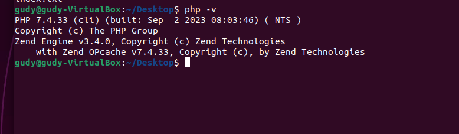
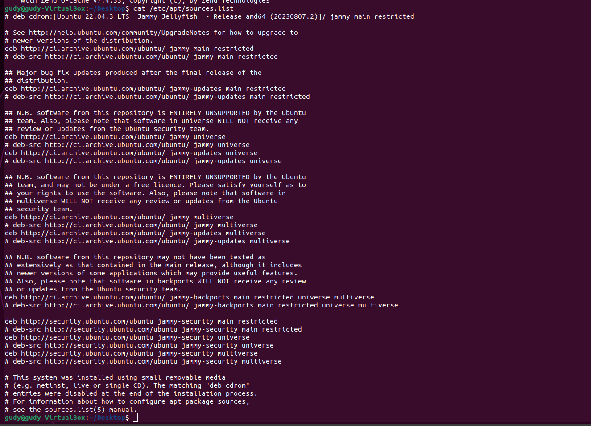

# Exercise

## Task:

- Install PHP 7.4 on your local linux machine using the ppa:ondrej/php package repo

## Instructions:

- Learn how to use the add-apt-repository cammand
- Submit the content of /etc/apt/sources.list and the output of php -v command.

`php -v`

`/etc/apt/sources.list`

