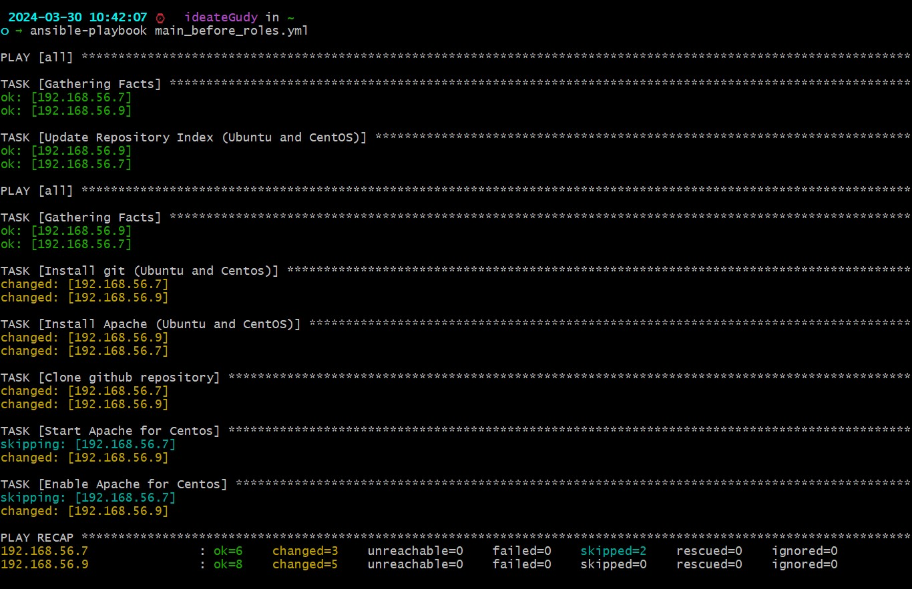
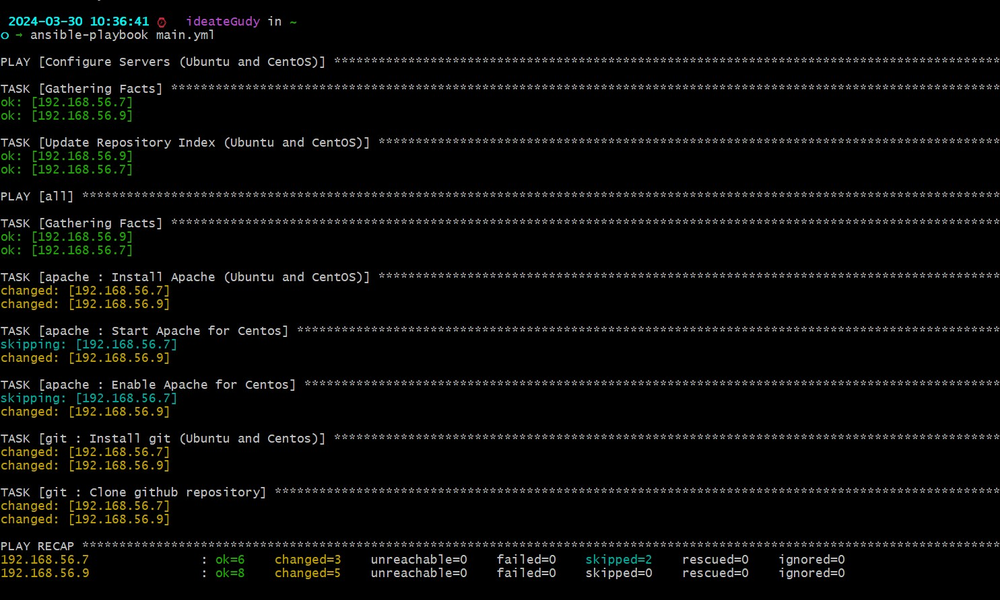
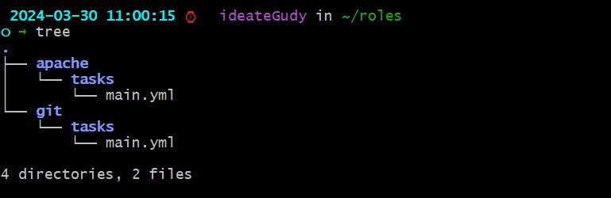

# Deploying An Open Source Application On Github Using Ansible

- Your ansible slave will consist of one ubuntu node and one centos(rhel) node.
- Your master node can be of any Linux distribution of your choice(3 nodes in all).
- Explore using variables in ansible while executing this task.

### Ansible Playbook before adding roles

- Inventory File

`hosts`

```
[centos]
192.168.56.9 Apache_package_name=httpd Apache_service_name=httpd

[ubuntu]
192.168.56.7 Apache_package_name=apache2 Apache_service_name=apache2

```

`main_before_roles.yml`

```---
- hosts: all
  become: true
  pre_tasks:
    - name: Update Repository Index (Ubuntu and CentOS)
      package:
        update_cache: yes
      changed_when: false

- hosts: all
  become: true
  vars:
    github_repo_url: https://github.com/ideateGudy/shopping-list.git
    destination_path: /var/www/html

  tasks:
    - name: Install git (Ubuntu and Centos)
      tags: ubuntu,centos,git
      package:
        name: git
        state: present

    - name: Install Apache (Ubuntu and CentOS)
      tags: ubuntu,centos,apache
      package:
        name: "{{ Apache_package_name }}"
        state: present

    - name: Clone github repository
      git:
        repo: "{{ github_repo_url }}"
        dest: "{{ destination_path }}"
        force: yes

    - name: Start Apache for Centos
      service:
        name: "{{ Apache_service_name }}"
        state: started
      when: ansible_distribution == 'CentOS'

    - name: Enable Apache for Centos
      service:
        name: "{{ Apache_service_name }}"
        enabled: yes
      when: ansible_distribution == 'CentOS'
```

## Result:



### Ansible Playbook with roles

- Inventory File

`hosts`

```
[centos]
192.168.56.9 Apache_package_name=httpd Apache_service_name=httpd

[ubuntu]
192.168.56.7 Apache_package_name=apache2 Apache_service_name=apache2

```

`main.yml`

```
---

- hosts: all
  become: true
  pre_tasks:

  - name: Update Repository Index (Ubuntu and CentOS)
    package:
    update_cache: yes
    changed_when: false

- hosts: all
  become: true
  vars:
  github_repo_url: https://github.com/ideateGudy/shopping-list.git
  destination_path: /var/www/html
  roles:
  - apache
  - git

```

`roles/apache/tasks/main.yml`

```

- name: Install Apache (Ubuntu and CentOS)
  tags: ubuntu,centos,apache
  package:
  name: "{{ Apache_package_name }}"
  state: present

- name: Start Apache for Centos
  service:
  name: "{{ Apache_service_name }}"
  state: started
  when: ansible_distribution == 'CentOS'

- name: Enable Apache for Centos
  service:
  name: "{{ Apache_service_name }}"
  enabled: yes
  when: ansible_distribution == 'CentOS'

```

`roles/git/tasks/main.yml`

```

- name: Install git (Ubuntu and Centos)
  tags: ubuntu,centos,git
  package:
  name: git
  state: present

- name: Clone github repository
  git:
  repo: "{{ github_repo_url }}"
  dest: "{{ destination_path }}"
  force: yes

```

## Result:



- Roles tree structure


