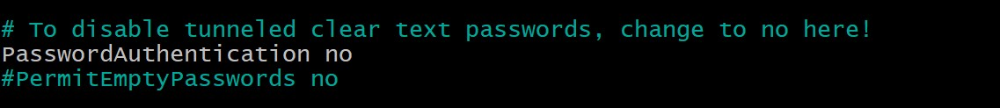
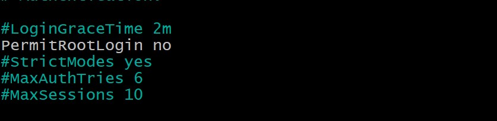

# Exercise:

> Your login name: altschool i.e., home directory /home/altschool. The home directory contains the following sub-directories: code, tests, personal, misc Unless otherwise specified, you are running commands from the home directory.

`root@ubuntu-focal:~# useradd -m -s /bin/bash altschool` // Create user altschool (root user)

`altschool@ubuntu-focal:~$ mkdir code tests personal misc` // Create folders

## Instructions:

> a. Change directory to the tests directory using absolute pathname

```
altschool@ubuntu-focal:~$ cd /home/altschool/tests
altschool@ubuntu-focal:~/tests$
```

> b. Change directory to the tests directory using relative pathname

```
altschool@ubuntu-focal:~$ cd ./tests
altschool@ubuntu-focal:~/tests$
```

> c. Use echo command to create a file named fileA with text content ‘Hello A’ in the misc directory

```
altschool@ubuntu-focal:~$ echo "Hello A" > misc/fileA
altschool@ubuntu-focal:~$ cat misc/fileA
Hello A
altschool@ubuntu-focal:~$

```

> d. Create an empty file named fileB in the misc directory. Populate the file with a dummy content afterwards

```
altschool@ubuntu-focal:~$ touch misc/fileB
altschool@ubuntu-focal:~$ vi misc/fileB
altschool@ubuntu-focal:~$ cat misc/fileB
 Lorem ipsum dolor sit, amet consectetur adipisicing elit.  Impedit dolor totam deserunt odit maiores, similique quibusdam suscipit vitae
 consectetur aspernatur.
altschool@ubuntu-focal:~$

```

> e. Copy contents of fileA into fileC

```
altschool@ubuntu-focal:~$ cp misc/fileA misc/fileC
altschool@ubuntu-focal:~$ cat misc/fileC
Hello A
altschool@ubuntu-focal:~$
```

> f. Move contents of fileB into fileD

```
altschool@ubuntu-focal:~$ mv misc/fileB misc/fileD
altschool@ubuntu-focal:~$ cat misc/fileD
Lorem ipsum dolor sit, amet consectetur adipisicing elit. Impedit dolor totam deserunt odit maiores, similique quibusdam suscipit vitae
 consectetur aspernatur.
altschool@ubuntu-focal:~$

```

> g. Create a tar archive called misc.tar for the contents of misc directory

```
altschool@ubuntu-focal:~$ tar -cvf misc.tar misc
misc/
misc/fileA
misc/fileD
misc/fileC
altschool@ubuntu-focal:~$ ls
code  misc  misc.tar  personal  tests
altschool@ubuntu-focal:~$
```

> h. Compress the tar archive to create a misc.tar.gz file

```
altschool@ubuntu-focal:~$  gzip misc.tar
altschool@ubuntu-focal:~$ ls
code  misc  misc.tar.gz  personal  tests
altschool@ubuntu-focal:~$
```

> I. Create a user and force the user to change his/her password upon login

```
root@ubuntu-focal:~# usermod -aG sudo altschool
root@ubuntu-focal:~# exit
vagrant@ubuntu-focal:~$ sudo su - altschool
altschool@ubuntu-focal:~$ sudo adduser james
altschool@ubuntu-focal:~$ sudo chage -d 0 james
altschool@ubuntu-focal:~$
```

> J. Lock a users password

```
altschool@ubuntu-focal:~$ sudo passwd -l james
```

> K. Create a user with no login shell

```
altschool@ubuntu-focal:~$ sudo useradd -s /sbin/nologin mary
```

> L. Disable password based authentication for ssh

```
altschool@ubuntu-focal:~$ sudo vi /etc/ssh/sshd_config
```



> M. Disable root login for ssh

```
altschool@ubuntu-focal:~$ sudo vi /etc/ssh/sshd_config
```


