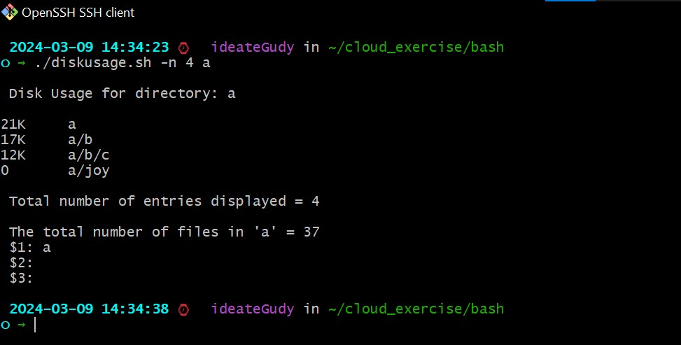
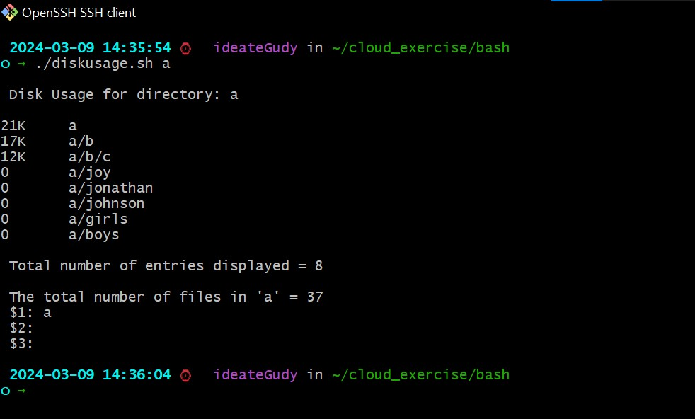
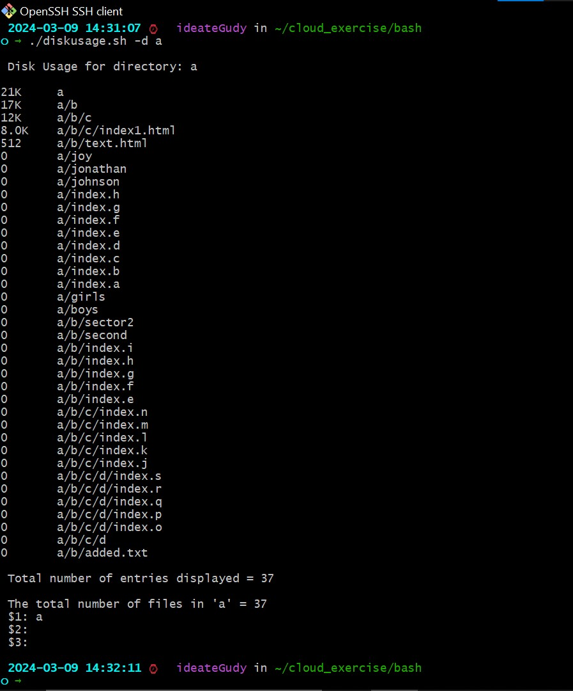
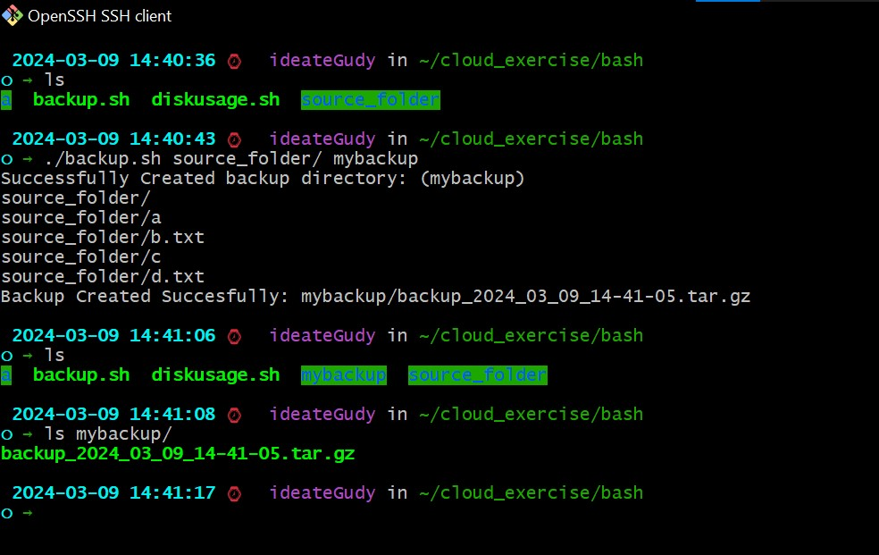
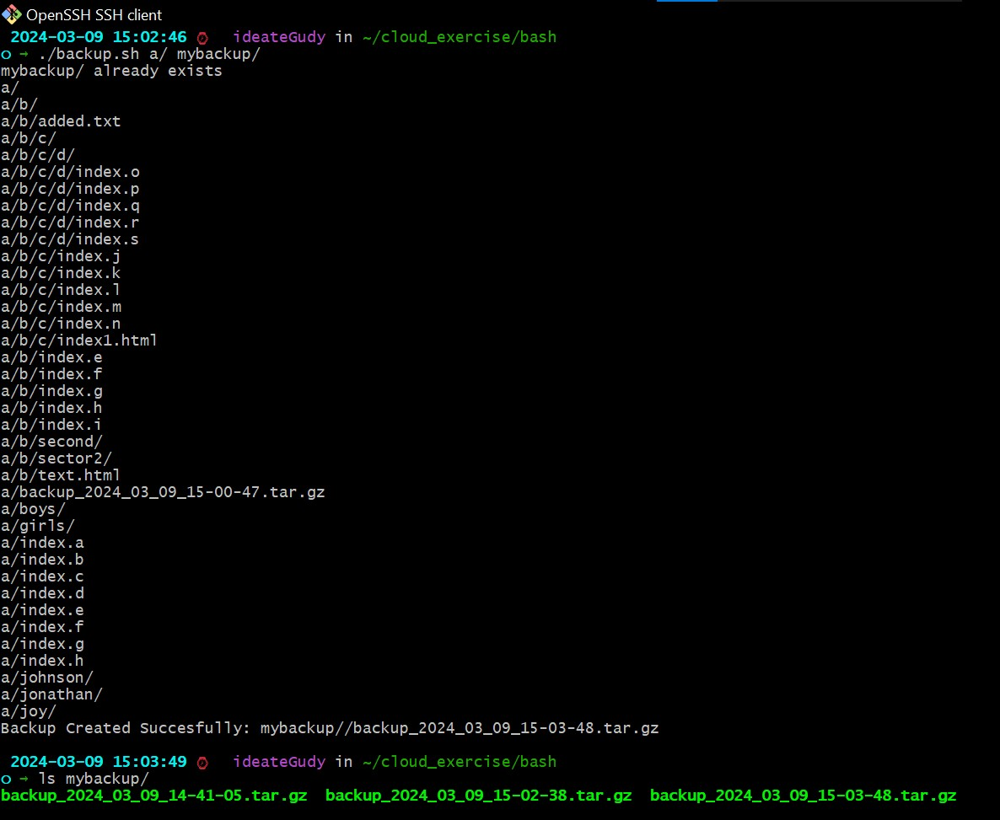

# 1. Write a shell script that checks the disk usage in a given directory.

- the script can take two optional arguments and one compulsory argument...
- -d: which means that all files and directory within the specified directory or directories should be listed.
- -n: which means that the top N enteries should be returned.
- list of directories: this will be the directories you want to check it's disk usage

`eg yourscript.sh -n 5 /var`

### should return the top 5 directories disk usage in /var directory

`yourscript.sh -d /var`

### should list both directories and files

## Note: if -n argument is not given, it should return 8 enteries by default.

# 2. Create a backup script. This script creates a backup of a given directory and saves it in another directory with a timestamp. It takes two arguments:

- the source directory and the destination directory

## Note: The backup should be a tar archive

---

### 1. Where 'a' is the name of the directory

---

```
./diskusage.sh -n 4 a
```

## Result:



```
./diskusage.sh a
```

## Result:



```
./diskusage.sh -d a
```

## Result:



### 2. Where 'mybackup' is the name of the directory where all my backup files will be saved

```
./backup.sh source_folder/ mybackup
```

## Result:



```
./backup.sh a/ mybackup
```

## Result:


